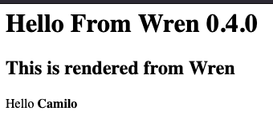

# Super Web Framework Wren Baron


スーパーウェブフレームワーク Wren Baron

This is a small proof of concept to execute [Wren Scripts](https://wren.io)
inside a web environment.

This is made using `PHP` as a bridge in a `cgi-bin` executable.

First create a new directory and put `index.php` in with the the code.

We are using [Wren Console](https://github.com/joshgoebel/wren-console) for additional modules such as _JSON_ support.

**index.php**

The _PHP_ script simply encodes a _JSON_ object with environment variables such as GET and POST params and then pass them to the `wren` script as an argument.

Also the final `2>&1` enables debugging the _Wren_ scripts so they output errors as well.

```php
<?php

session_start();

$env = escapeshellarg(json_encode([
    "get" => $_GET,
    "post" => $_POST,
    "server" => $_SERVER,
    "session" => session_id(),
    "pwd" => getcwd()
    ]));

$wren = "../wrenc index.wren $env 2>&1";

passthru($wren);
?>
```

**index.wren**

This file will get the enviroment as a JSON string and parse it
to obtain the `GET` params.

```wren
import "runtime" for Runtime
import "os" for Process
import "json" for JSON

var args = Process.allArguments
var env = JSON.parse(args[2])
var name = env["get"]["name"]

System.print("<h1>Hello From Wren %(Runtime.WREN_VERSION)</h1>")
System.print("<h2>This is rendered from <strong>Wren</strong></h2>")
System.print("<p>Hello <strong>%(name)</strong></p>")
```

The URL can now use the `name` param in a `GET` request.

```text
cgi-bin/hello/?name=Camilo
```



## Wren Console Compilation

The version provided here was dynamically linked with `libc 2.17` since that was the available in the shared hosting.

If we want to check the libc version, you can use

```bash
$ ldd --version
ldd (GNU libc) 2.17
Copyright (C) 2012 Free Software Foundation, Inc.
```

If we try to use `wrenc` in an enviroment that does not have the correct libc we will see an error similar to this:

```bash
./wrenc: /lib64/libm.so.6: version `GLIBC_2.29' not found (required by ./wrenc)
```

The provided `make` command builds the `wrenc` binary for this linux environment

```bash
$ make install
```

We use an old Ubuntu for the Dockerfile that already has libc 2.17.

```dockerfile
FROM ubuntu:13.04

RUN sed -i 's/archive.ubuntu/old-releases.ubuntu/g' /etc/apt/sources.list
RUN apt-get update
RUN apt-get install build-essential -y

COPY . /wrenc

WORKDIR /wrenc/projects/make/
RUN make config=release_64bit

RUN /wrenc/bin/wrenc -v

# So we can execute commands
# and do not exits
CMD tail -f /dev/null
```

## Credits

<p>
  Made with <i class="fa fa-heart">&#9829;</i> by
  <a href="https://ninjas.cl">
    Ninjas.cl
  </a>.
</p>
